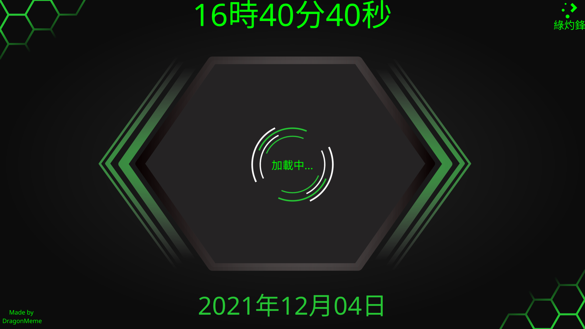

# Green-Honeycomb
Splash screen for KDE Desktop.

# Setup
Note: This instructions are based on usage of KDE Neon.

1.) Clone this repository via the command below:
```
git clone https://github.com/kde69420/Green-HoneyComb-SplashScreen.git $USER/.local/share/plasma/look-and-feel/Green-Honeycomb
```
The command will automatically set its location to the one set by KDE so the option to select this splash screen is instantly available.

2.) Go to System Settings > Appearance > Splash Screen

3.) Select the splash-screen with the preview that looks like this:


# Credits
Night-App (NightSoftware@outlook.com) for the original copy.
